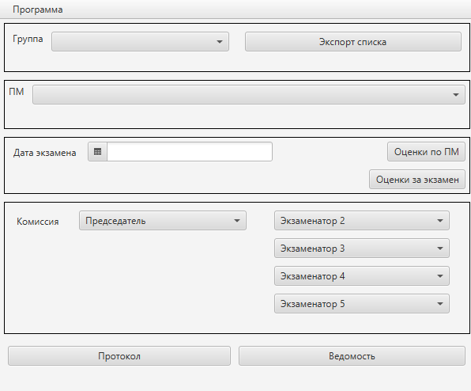
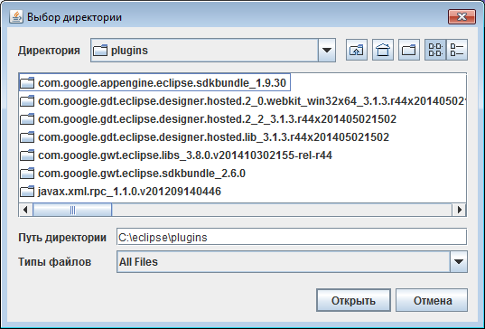
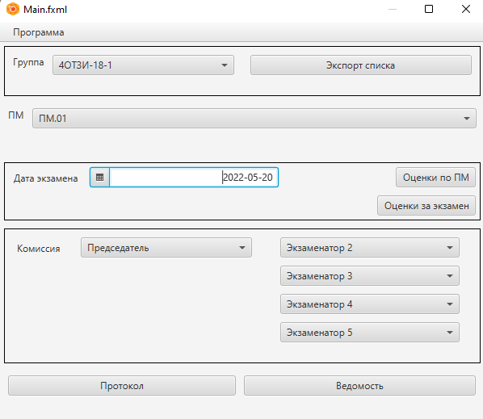
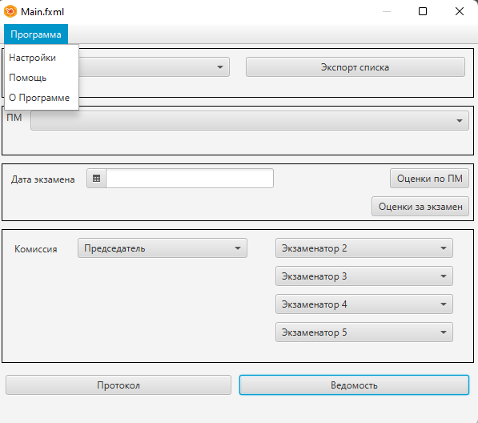
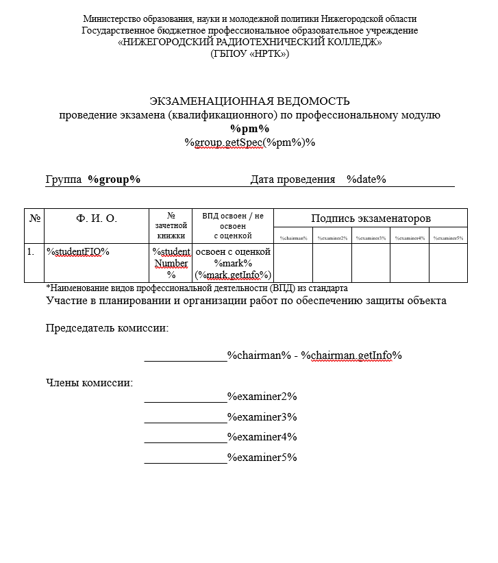

# Руководство пользователя
######Созданно специально для НРТК
##Старт программы

###Программа требует для запуска
<ol>
  <li><code>Java => 11 ver.</code></li>
   <li><code>Монитор разрешением не ниже 600x800</code></li>
</ol>

##Как сгенерировать Ведомость и Протокол

####После старта программа выглядит вот так

####Вам требуется экспортировать список в формате `.csv`,`xls`,`ods`.

####Далее заполните дату, экзаменаторов, ПМ и группу.

####И нажаете на нужный документ
####Готово документ создан и сформирован по пути который вы указали в настройках

##Доп информация
#### В меню программы вы можете перейти в
<ol>
<li>В настройки программы</li>
<li>Открыть руководство пользователя - вы сейчас в нём находитесь</li>
<li>Открыть информацию о программе</li>
</ol>

##Таблица элементов
| Элемент в документе   | Описание                             |
|-----------------------|--------------------------------------|
| %pm%                  | ПМ                                   |
| %group%               | Группа                               |
| %group.getSpec(%pm%)% | Получить специальность группы        |
| %date%                | Дата проведения                      |
| %studentFIO%          | ФИО Студента                         |
| %studentNumber%       | Номер книжки                         |
| %mark%                | Оценка                               |
| %mark.getInfo%        | (Хорошо, Отлично, Удовлетворительно) |
| %chairman%            | Председатель                         |
| %chairman.getInfo%    | Инормация о председателе             |
| %examiner(1-4)%       | Экзаменатор                          |

##Шаблоны по которым будут формироваться документы

###*Ведомость*

###*Протокол*

#####Создал для дипломного проекта [Bur1y](https://github.com/bur1y).
