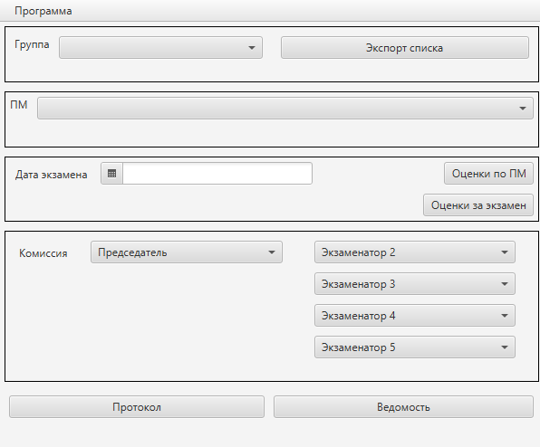
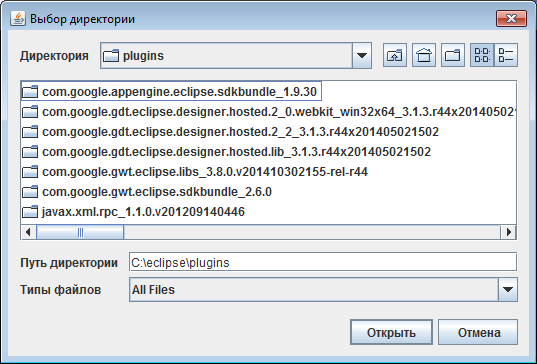
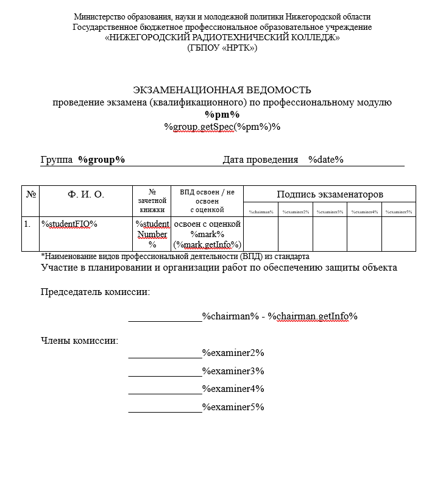
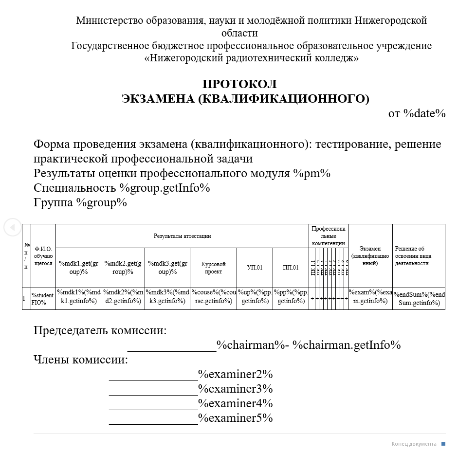

# Руководство пользователя #
<h4>Созданно специально для НРТК</h4>
<h2>Старт программы</h2>

<h3>Программа требует для запуска</h3>
<ol>
  <li><code>Java => 11 ver.</code></li>
   <li><code>Монитор разрешением не ниже 600x800</code></li>
</ol>

<h2>Как сгенерировать Ведомость и Протокол</h2>

<h4>После старта программа выглядит вот так</h4>

<h4>Вам требуется экспортировать список в формате `.csv`,`xls`,`ods`.</h4>

<h4>Далее заполните дату, экзаменаторов, ПМ и группу.</h4>

<h4>И нажимаете по кнопке на нужный документ
Готово документ создан и сформирован по пути который вы указали в настройках</h4>

<h2>Доп информация</h2>
<h4> В меню программы вы можете перейти в</h4>
<ol>
<li>В настройки программы</li>
<li>Открыть руководство пользователя - вы сейчас в нём находитесь</li>
<li>Открыть информацию о программе</li>
</ol>

<h2>Таблица элементов</h2>
| Элемент в документе   | Описание                             |
|-----------------------|--------------------------------------|
| %pm%                  | ПМ                                   |
| %group%               | Группа                               |
| %group.getSpec(%pm%)% | Получить специальность группы        |
| %date%                | Дата проведения                      |
| %studentFIO%          | ФИО Студента                         |
| %studentNumber%       | Номер книжки                         |
| %mark%                | Оценка                               |
| %mark.getInfo%        | (Хорошо, Отлично, Удовлетворительно) |
| %chairman%            | Председатель                         |
| %chairman.getInfo%    | Инормация о председателе             |
| %examiner(1-4)%       | Экзаменатор                          |

<h2>Шаблоны по которым будут формироваться документы</h2>

<h3>*Ведомость*</h3>

<h3>*Протокол*</h3>

<h5>Создал для дипломного проекта [Bur1y](https://github.com/bur1y).</h5>
